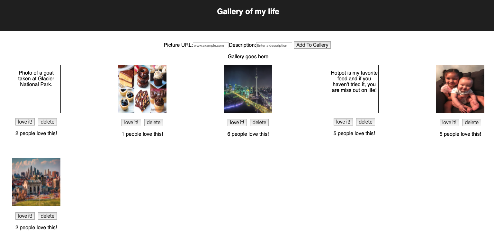

# Weekend Challenge #4: React - Gallery of My Life

[Here](./INSTRUCTIONS.md) is the project instructions.

## Description

For this challenge, I created a gallery page to share pictures and things that are important to me. Users can click on an image to see a description and click the description and see the image again. Users can also click the "love it!" button to "like" an image or click the "delete" button to remove the item from the gallery. Below the buttons, there is a message shows how many "likes" each item received.

On the top part of the page, users can add items to the gallery.

## Screen Shot

### Prerequisites

- [Node.js](https://nodejs.org/en/)

## Installation

1. Create a database named `react_gallery`,
2. The queries in the `database.sql` file are set up to create all the necessary tables and populate the needed data to allow the application to run correctly. The project is built on [Postgres](https://www.postgresql.org/download/), so you will need to make sure to have that installed. We recommend using Postico to run those queries as that was used to create the queries,
3. Open up your editor of choice and run an `npm install`
4. Run `npm run server` in your terminal
5. Run `npm run client` in your terminal
6. The `npm run client` command will open up a new browser tab for you!

## Built With

javascript, node, axios, pg, express, body-parser, SQL, Postman, Postico, Postgres, React

## Acknowledgement

Thanks to [Prime Digital Academy](www.primeacademy.io) who equipped and helped me to make this application a reality.

## Support

If you have suggestions or issues, please email me at [beileiwang@gmail.com](beileiwang@gmail.com).
